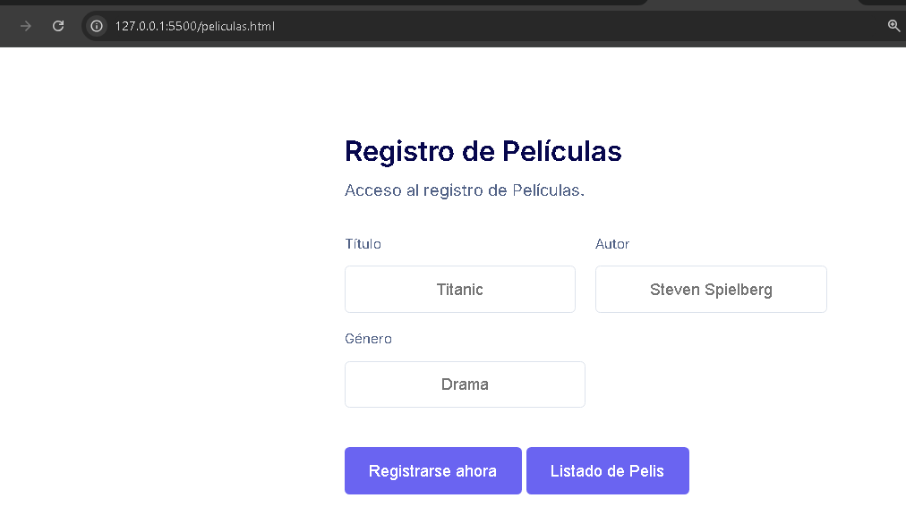
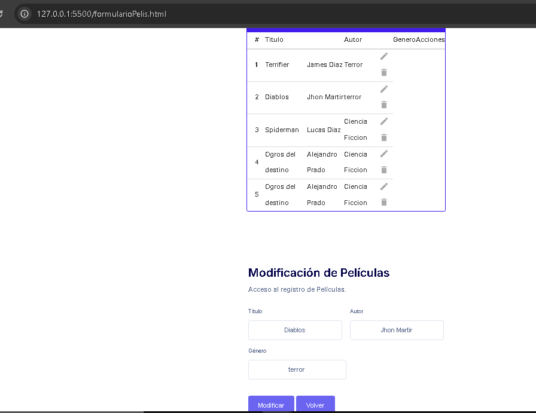
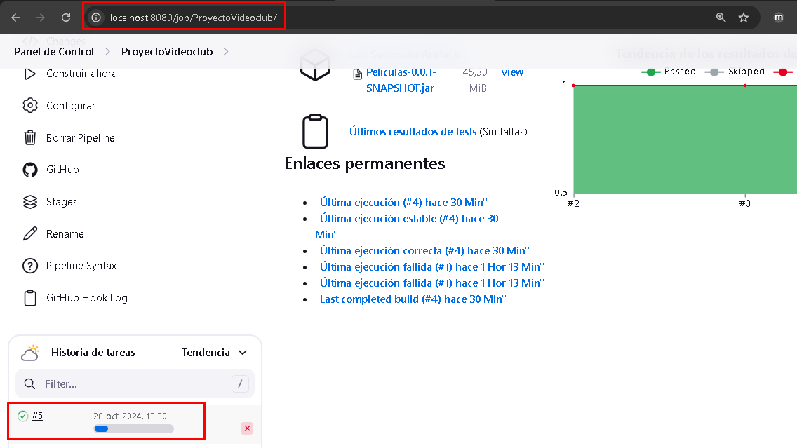
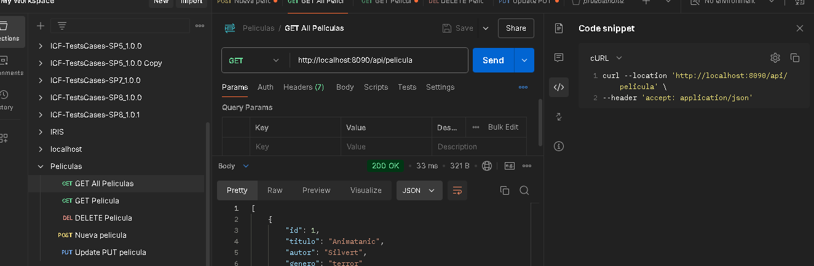
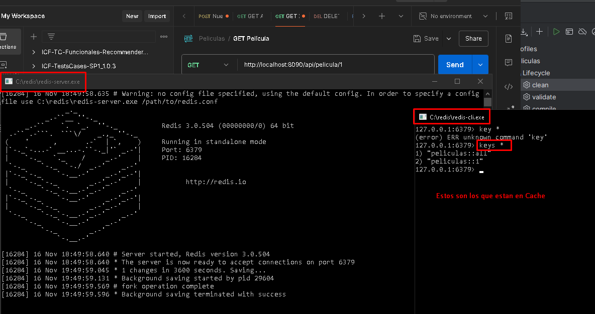
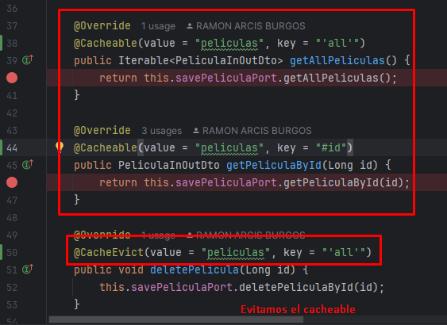

# Getting Started
Tenemos un proyecto de VideoClup, de registrar Peliculas.

En Front tenemos un proyecto videoclubFront, con el lenguaje Html, CSS y Javascript.
Git: https://github.com/elramonete/videoclubFront
Alta de registro:
Url: http://127.0.0.1:5500/peliculas.html

Listado de peliculas :
UrlFormulario: http://127.0.0.1:5500/formularioPelis.html

Añadimos la herramienta Jenkins para la automatizacion CI/CD en el desarrollo del software.
Previamente en github sobre el proyecto que tenemos en Jenkins debemos de añadir en setting/Webhooks, la URL. De esta forma cuando realizamos un commit automaticamente se autodespliega en el Jenkins.
Jenkins_Url: http://localhost:8080/job/ProyectoVideoclub/

### Reference Documentation 

Pruebas nuevas

Obtener todas las peliculas o guardar peliculas desde el postman.
http://localhost:8090/api/pelicula
Postman: 
GET ALL Peliculas (todas las peliculas)
GET Pelicula (una pelicula por id)
DELETE Pelicula (borramos una pelicula por id)
POST Pelicula (nueva pelicula)
PUT Pelicula (actualizar pelicula)

Hemos añadido el Cacheable de REDIS, para el get all y el getbyId. 
Y el guardar, actualizar y borrar CacheEvict lo desactivamos.

